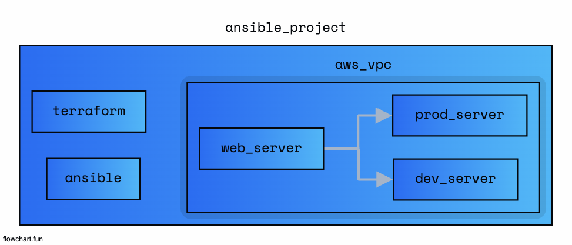

# infra-automation use ansible

## Architecture

- 1. terraform (aws service 생성)

- 2. ansible (aws service의 내부 설정 provisioning)

## Folders

- infra (terraform services)
- ansible (ansible configs)

## Refernece

- <a href="https://docs.ansible.com/ansible/latest/getting_started/index.html">Ansible get-started</a>
