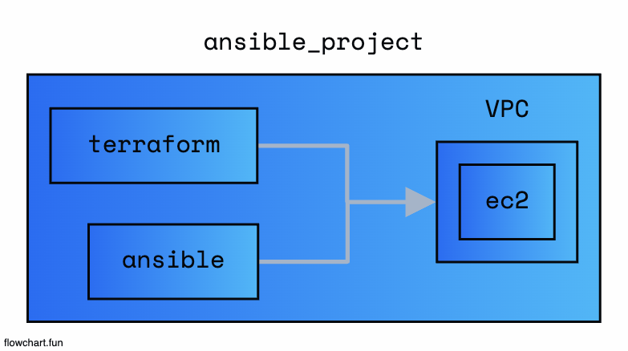

# infra-automation use ansible

## Install

```
    brew install ansible
```

## Execute

```
    // Execute Terraform (vpc + ec1)
    cd infra
    terraform init && terraform apply

    // Execute Ansible
    cd ansible
    ansible-playbook -i ./inventory.ini install.yml

```

## Architecture



- terraform (aws service 생성)
- ansible (aws service의 내부 설정 provisioning)

## Ansible

    - 여러대의 서버에 동일한 환경을 유지하기 위한 Infrastructure as a Code
    - Terraform과 같이 멱등성 존재 (수정된 부분이 있다면 -> 그것만 반영)
    - Inventory -> 제어될 대상을 정의
    - Playbook -> 대상들의 대한 Task 정의
    - Module -> Task들이 어떻게 수행될지 정의

## Folders

- infra (terraform services)
- ansible (ansible configs)

## Refernece

- <a href="https://docs.ansible.com/ansible/latest/getting_started/index.html">Ansible get-started</a>

## Result

- Terraform으로 인프라를 구성하고 Ansible로 각각의 대한 인프라의 대한 설정을 한다는 점은 환경설정에서 엄청난 짝꿍스
- 각각의 리눅스 설정의 대해서 Ansible로 구성하는 것은 좋은듯...
